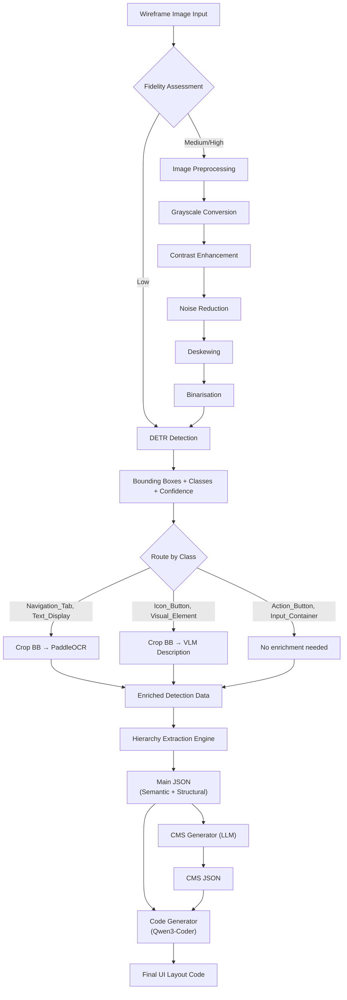

# Wireframe-to-UI-Code Pipeline — Deep Analysis

## 1. What I Understand (End-to-End Pipeline)

### 1.1 Goal
Take a wireframe image (low/medium/high fidelity) as input and produce **production-ready UI layout code** by:
1. Detecting UI components with a custom-trained DETR model
2. Extracting text via OCR and descriptions via VLM — **selectively per class**
3. Building a rich, semantically meaningful **Main JSON** (component hierarchy + spatial/semantic context)
4. Generating a **CMS JSON** (content management data extracted from the UI)
5. Feeding both JSONs into a coding LLM (Qwen3-Coder) to produce the final UI code

---

### 1.2 The 6 Detection Classes

| Class | Purpose | Post-Detection Action |
|---|---|---|
| `Action_Button` | Clickable action elements (submit, save, etc.) | — (no special enrichment specified) |
| `Icon_Button` | Buttons with icons/symbols | **VLM** → one-line description |
| `Input_Container` | Text inputs, dropdowns, form fields | — |
| `Navigation_Tab` | Navigation tabs, menu items | **PaddleOCR** → extract text |
| `Text_Display` | Static text blocks, labels, headings | **PaddleOCR** → extract text |
| `Visual_Element` | Images, illustrations, decorative visuals | **VLM** → one-line description |

---

### 1.3 Pipeline Stages (My Understanding)



---

## 2. Detailed Stage Breakdown

### Stage 1: Image Preprocessing (Conditional)

The flowchart shows preprocessing only for **medium/high fidelity** inputs. Low fidelity goes straight to DETR.

> [!NOTE]
> This is somewhat counterintuitive — low-fidelity wireframes (rough sketches) typically need *more* preprocessing, not less. Medium/high fidelity wireframes (Figma exports, clean digital mockups) usually need *less* preprocessing since they're already clean digital images.

**Steps**: Grayscale → Contrast Enhancement → Noise Reduction → Deskewing → Binarisation

### Stage 2: DETR Object Detection

- Custom-trained DETR model (you have `model.pth` — 534MB, which is consistent with a DETR-ResNet-50/101 model)
- Outputs: bounding boxes, class labels (6 classes), confidence scores
- The flowchart mentions sub-type classification as well (e.g., `detr_class: "button"` → `sub_type: "radio_button"`)

### Stage 3: Class-Specific Enrichment (The Core Routing Logic)

This is the heart of your revised pipeline:

**PaddleOCR Route** (Navigation_Tab, Text_Display):
- Crop the bounding box region from the original image
- Pass **only that crop** to PaddleOCR (not the whole image)
- Extract text content with position data

**VLM Route** (Icon_Button, Visual_Element):
- Crop the bounding box region from the original image
- Pass **only that crop** to Qwen3-VL (your VLM)
- Get a one-line semantic description (e.g., "search magnifying glass icon", "user profile avatar placeholder")

**No Enrichment** (Action_Button, Input_Container):
- These retain only their detection metadata (class, bbox, confidence)

### Stage 4: Hierarchy Extraction → Main JSON

This is the **most critical and complex** part. The engine needs to:
1. **Spatial Context**: Determine parent-child relationships from bounding box nesting/overlap
2. **Descriptive Entity**: Assign semantic meaning (header, sidebar, card, form-group, etc.)
3. **Semantic Context**: Understand the *role* of components relative to each other

### Stage 5: CMS JSON Generation

An LLM generates a CMS data file containing:
- All extractable content (text, labels, placeholders)
- Structured for easy content management and swapping
- This is generated **first**, before code generation

### Stage 6: Code Generation

- Qwen3-Coder receives: **Main JSON** + **CMS JSON**
- Produces: Final UI layout code

### Stage 7: Validation (Deferred for now)
- ESLint syntax validation
- Ajv CMS structure validation
- LLM-based deep structure validation
- Regeneration loop on errors

---

## 3. Node.js/TypeScript Feasibility Assessment

> [!IMPORTANT]
> You mentioned the company codebase is in Node.js, so Python is not an option. Here's a realistic assessment of each component.

### ✅ Fully Feasible in TypeScript/Node.js

| Component | Library/Approach | Notes |
|---|---|---|
| **PaddleOCR** | [`ppu-paddle-ocr`](https://www.npmjs.com/package/ppu-paddle-ocr) or [`paddleocr`](https://www.npmjs.com/package/paddleocr) | Runs PP-OCR models via ONNX Runtime natively in Node.js. No Python needed. `ppu-paddle-ocr` supports PP-OCRv5 and is actively maintained. |
| **Image Preprocessing** | [`sharp`](https://www.npmjs.com/package/sharp) | Industry-standard for Node.js image manipulation. Supports grayscale, contrast, noise reduction, cropping, resize. High performance (libvips). |
| **Image Cropping (BB extraction)** | `sharp.extract({ left, top, width, height })` | Perfectly suited for cropping bounding box regions before passing to OCR/VLM. |
| **VLM API calls** | Standard HTTP / `fetch` or OpenAI-compatible SDK | Qwen3-VL on Bedrock uses OpenAI-compatible API. Send base64 image + prompt, get text back. Trivial in TS. |
| **Coding LLM API calls** | Standard HTTP / AWS Bedrock SDK | Qwen3-Coder on Bedrock. Same pattern as VLM. |
| **CMS JSON creation** | Pure TypeScript logic | JSON manipulation is native to JS/TS. |
| **ESLint validation** | `eslint` npm package | Native JS tool. |
| **Ajv validation** | `ajv` npm package | Native JS JSON schema validator. |

### ⚠️ Feasible With Extra Work

| Component | Library/Approach | Caveats |
|---|---|---|
| **DETR Inference** | `onnxruntime-node` or `@huggingface/transformers` | Your `model.pth` (PyTorch) must first be **converted to ONNX format**. This is a **one-time Python step** (using `torch.onnx.export` or HuggingFace `optimum`). After conversion, all inference runs in pure Node.js via ONNX Runtime. |
| **Image tensor preprocessing for DETR** | `sharp` + manual normalization | DETR requires specific input normalization (ImageNet mean/std, resize to 800×800, etc.). You'll need to manually convert image buffers to `Float32Array` tensors. Not hard, but requires careful implementation. |
| **Binarisation / Deskewing** | `sharp` + potentially `opencv4nodejs` or custom logic | Sharp handles basic thresholding. For advanced deskewing (Hough transform), you may need `opencv4nodejs-prebuilt` or implement a simpler approach. |

### 🔴 Requires One-Time Python Step

| Component | What | Why |
|---|---|---|
| **Model Conversion** | Convert `model.pth` → `model.onnx` | PyTorch export to ONNX is a Python-only operation. This is a **one-time setup step**, not a runtime dependency. After conversion, the entire runtime is pure TypeScript. |

---

## 4. Questions & Ambiguities

### Critical Questions

> [!IMPORTANT]
> These will directly affect the architecture and implementation.

**Q1: Action_Button and Input_Container — What happens with them?**
You specified OCR for Navigation_Tab/Text_Display and VLM for Icon_Button/Visual_Element. But what about:
- **Action_Button**: These often have text labels ("Submit", "Cancel", "Sign Up"). Should we also OCR these? Or do we infer their label from spatial proximity to Text_Display elements?
- **Input_Container**: These often have placeholder text or labels. Same question — OCR them or not?

**Q2: What is the target output code format?**
- Is the final code React/JSX? Plain HTML/CSS? A specific component library (Material UI, Ant Design, etc.)?
- Does the output need to be responsive?
- Is there a specific design system or token set it should map to?

**Q3: Model architecture details for the DETR model?**
- Is this a standard DETR (ResNet backbone) or a variant (Deformable DETR, RT-DETR, etc.)?
- What input resolution was it trained on?
- What's the model's output format (logits shape, box format — cxcywh vs xyxy)?
- Do you have the model's config/architecture definition file, or just the `.pth` weights?

**Q4: Fidelity assessment — how is it determined?**
- Is fidelity provided as user input (dropdown: low/medium/high)?
- Or should it be auto-detected? If so, how? (This is a non-trivial problem itself)

**Q5: Sub-type classification**
- The flowchart shows a "UI Symbol Classifier (CNN)" and "VLM (For Fallback)" for sub-type classification (e.g., button → radio_button). Is this still needed? You mentioned 6 classes — are sub-types relevant?
- If yes, do you have a trained CNN for this, or should the VLM handle sub-type classification too?

**Q6: What content does the CMS JSON hold?**
- Is it just extracted text mapped to component IDs?
- Or is it more structured — like a page's content model (headings, paragraphs, button labels, image alts, navigation items)?
- Do you have an example schema or desired format?

**Q7: Bedrock API specifics**
- I see your `.env` has `QWEN_API_KEY` with what looks like a Bedrock-style key. Are you using AWS Bedrock for both the VLM and coding model?
- What region? Are there rate limits we need to handle?

---

### Design Questions

**Q8: Error handling and confidence thresholds**
- What confidence threshold should we use for DETR detections? Below threshold → discard? Or flag for review?
- If PaddleOCR returns empty/low-confidence text, do we fallback to VLM for text extraction?

**Q9: Batch vs. single image processing?**
- Is this processing one wireframe at a time, or should it handle multi-page wireframes / batch processing?

**Q10: Hierarchy resolution — what spatial rules?**
- Parent-child: Is it purely containment-based (BB A fully contains BB B → B is child of A)?
- What about partial overlaps?
- How do you determine semantic grouping (e.g., a label + input that are siblings, not parent-child)?
- Do you want reading order (top-to-bottom, left-to-right) encoded in the hierarchy?

---

## 5. Proposed Improvements

### 5.1 OCR Action_Buttons too
Action buttons almost always have text labels. I'd recommend adding them to the PaddleOCR route alongside Navigation_Tab and Text_Display. Without OCR, you lose critical information like "Submit", "Cancel", "Add to Cart".

### 5.2 OCR or VLM Input_Containers too
Input containers often have placeholder text or associated labels. Consider at least OCR-ing them, or using the VLM to describe the expected input type.

### 5.3 Rethink the preprocessing fidelity logic
Currently: medium/high → preprocess, low → skip. I'd suggest:
- **Low fidelity** (hand-drawn sketches): Heavy preprocessing (deskew, denoise, binarize, enhance)
- **High fidelity** (clean digital/Figma exports): Minimal/no preprocessing
- **Medium**: Light preprocessing

Or better yet: make preprocessing adaptive — always run a quality assessment, then apply only the steps that improve detection quality.

### 5.4 Add an NMS (Non-Maximum Suppression) post-processing step
DETR is better than anchor-based detectors at avoiding duplicates, but it's not immune. A lightweight NMS or IoU-based dedup step after detection would catch edge cases — especially with overlapping components.

### 5.5 Spatial grouping before hierarchy extraction
Before building the hierarchy tree, run a spatial clustering step:
1. **Row detection**: Group components that share similar Y coordinates (same horizontal band)
2. **Column detection**: Group components that share similar X coordinates
3. **Section detection**: Identify large containers (header, sidebar, main, footer) first, then nest sub-components

This gives you a much stronger structural foundation than trying to infer hierarchy from raw bounding boxes alone.

### 5.6 Two-pass JSON generation
Consider building the Main JSON in two passes:
1. **Pass 1 — Structural**: Pure geometry. Containment, reading order, grid alignment
2. **Pass 2 — Semantic**: LLM-assisted. Take the structural tree + enrichment data (OCR text, VLM descriptions) and let an LLM annotate semantic roles (is this a "header nav"? a "search form"? a "product card"?)

This separates deterministic logic from LLM reasoning, making the pipeline more reliable and debuggable.

### 5.7 CMS schema definition upfront
Define a strict CMS JSON schema **before** implementation. This ensures:
- The CMS generator LLM produces consistent output
- The coding model knows exactly what data structure to expect
- Ajv validation (when added later) has a clear schema to validate against

### 5.8 Prompt engineering as a first-class concern
The quality of VLM descriptions and LLM code generation will be heavily prompt-dependent. I'd recommend:
- Creating a dedicated `prompts/` directory with versioned prompt templates
- Including few-shot examples in prompts for both VLM descriptions and code generation
- Making prompts configurable (not hardcoded)

---

## 6. Proposed Architecture (TypeScript/Node.js)

```
src/
├── config/                    # Configuration, env loading, thresholds
├── preprocessing/             # Image preprocessing pipeline (sharp)
├── detection/                 # DETR inference via ONNX Runtime
│   ├── model-loader.ts        # Load ONNX model
│   ├── preprocessor.ts        # Image → tensor conversion
│   ├── postprocessor.ts       # Tensor → bounding boxes + NMS
│   └── types.ts               # Detection result types
├── enrichment/                # Class-specific enrichment
│   ├── ocr.ts                 # PaddleOCR for Navigation_Tab, Text_Display
│   ├── vlm.ts                 # Qwen3-VL for Icon_Button, Visual_Element
│   └── router.ts              # Routes detections to OCR/VLM by class
├── hierarchy/                 # Hierarchy extraction engine
│   ├── spatial-analysis.ts    # Containment, proximity, alignment
│   ├── grouping.ts            # Section/row/column detection
│   ├── semantic-annotator.ts  # LLM-assisted semantic labeling
│   └── tree-builder.ts        # Build component tree
├── json-builder/              # Main JSON construction
│   ├── schema.ts              # Main JSON TypeScript types/interfaces
│   └── builder.ts             # Assemble final Main JSON
├── cms/                       # CMS JSON generation
│   ├── schema.ts              # CMS JSON types
│   └── generator.ts           # LLM-based CMS generation
├── codegen/                   # Code generation
│   ├── generator.ts           # Qwen3-Coder API calls
│   └── prompts/               # Prompt templates
├── prompts/                   # All prompt templates (versioned)
├── utils/                     # Shared utilities (image helpers, etc.)
└── index.ts                   # Main orchestrator / pipeline entry point
```

### Key Dependencies

| Package | Purpose |
|---|---|
| `onnxruntime-node` | DETR model inference |
| `sharp` | Image preprocessing, cropping |
| `ppu-paddle-ocr` or `paddleocr` | OCR for text extraction |
| `@aws-sdk/client-bedrock-runtime` | Qwen3-VL and Qwen3-Coder API calls |
| `ajv` (later) | CMS JSON schema validation |
| `eslint` (later) | Code syntax validation |

---

## 7. Risk Assessment

| Risk | Severity | Mitigation |
|---|---|---|
| DETR `.pth` → ONNX conversion fails for custom architecture | **High** | Need model architecture details. One-time Python script. Test thoroughly. |
| PaddleOCR Node.js packages are immature/buggy | **Medium** | Test `ppu-paddle-ocr` and `paddleocr` early. Fallback: Tesseract.js (lower quality) or VLM-based OCR. |
| Hierarchy extraction produces incorrect nesting | **High** | This is the hardest algorithmic problem. Needs robust spatial analysis + extensive testing with diverse wireframes. |
| VLM descriptions are inconsistent/verbose | **Medium** | Strong prompt engineering with few-shot examples + output length constraints. |
| Code generation quality varies | **Medium** | Strong structured prompts, CMS schema constraints, and (later) validation loop. |
| ONNX Runtime memory usage on large images | **Medium** | Resize inputs to DETR training resolution. Process sequentially, not in parallel. |

---

## 8. Summary — What I Need From You Before We Start

1. **Action_Button & Input_Container enrichment decision** (Q1)
2. **Target output format** — React? HTML? Which component library? (Q2)
3. **DETR model architecture details** — what architecture, input size, config file? (Q3)
4. **Fidelity — user input or auto-detect?** (Q4)
5. **Sub-type classification — still needed?** (Q5)
6. **CMS JSON example/schema** (Q6)
7. **API details — Bedrock region, any rate limits?** (Q7)
8. **Hierarchy rules — what defines parent-child?** (Q10)

Once these are clarified, I can produce a concrete implementation plan with task breakdown and execute.
