# Implementation Plan — Wireframe-to-UI-Code Pipeline

## Overview

Build a TypeScript/Node.js pipeline that takes a web UI image, detects UI components with a custom RF-DETR model, extracts text/descriptions selectively, constructs a semantically rich component hierarchy JSON, generates CMS data, and produces final React/JSX code.

> [!IMPORTANT]
> Each phase will be executed **only after your explicit approval**. No code will be written until a phase is approved.

---

## Consolidated Answers (From Your Comments)

| Topic | Decision |
|---|---|
| **Fidelity logic** | Low fidelity → preprocess. Medium/High → skip. 99% of inputs are clean web UI screenshots. |
| **Sub-type classification** | VLM handles this. No CNN. DETR only outputs the 6 classes. |
| **Action_Button / Input_Container** | No separate enrichment. Dataset marks Text_Display within them, so text is captured via nested Text_Display detections. |
| **Output format** | React/JSX. No design system. Web only. Not responsive. |
| **Model** | RF-DETR Medium, DINOv2 backbone. Trained at 704px (576px for sparse UIs). Outputs BB + class + confidence. |
| **Model inference** | Use `.pth` directly on company server. No ONNX conversion. |
| **Fidelity detection** | Build a script checking PPI, dimensions, sharpness. |
| **CMS schema** | You'll provide examples at Phase 6. |
| **APIs** | AWS Bedrock, Asia (Mumbai). Rate limits not a concern. |
| **Confidence threshold** | 0.4 — discard below. Accept all OCR text regardless of OCR confidence. |
| **Processing** | Single image, no batch. |
| **Hierarchy** | Full containment = parent-child. Reading order (top→bottom, left→right). Partial overlaps = TBD at Phase 5. |
| **NMS** | Yes, include post-detection NMS. |
| **Prompt engineering** | First-class concern. Versioned prompt templates. |

---

## Architecture Decision: DETR Inference

> [!IMPORTANT]
> **The `.pth` (PyTorch) model cannot be loaded directly in Node.js.** PyTorch is a Python framework. Since you want to use the `.pth` file as-is (no ONNX conversion), and it will live on the company server, the cleanest architecture is:
>
> **A lightweight Python inference microservice** (FastAPI or Flask, ~50 lines) running alongside your Node.js pipeline. Your TypeScript code sends an image via HTTP → the Python service runs RF-DETR inference → returns JSON detections. This is the standard production pattern for PyTorch model serving.
>
> This means: the pipeline codebase is **100% TypeScript**, with a thin Python inference server that exists solely to expose the model over HTTP. The Python service is a deployment artifact, not part of your application logic.

---

## Phase 1: Project Setup & Infrastructure

### Objective
Scaffold the TypeScript project, install all dependencies, configure environment, and establish the project structure.

### Implementation

#### 1.1 Initialize Project
- Run `npm init` and set up TypeScript with `tsconfig.json`
- Configure `ts-node` or `tsx` for direct TS execution during development
- Set up `.env` loading with `dotenv`

#### 1.2 Install Dependencies

| Package | Purpose | Phase Used |
|---|---|---|
| `typescript`, `tsx`, `@types/node` | TypeScript runtime | All |
| `dotenv` | Environment variable loading | All |
| `sharp` | Image preprocessing, cropping bounding boxes | 2, 4 |
| `ppu-paddle-ocr` + `onnxruntime-node` | OCR for Navigation_Tab, Text_Display | 4 |
| `@aws-sdk/client-bedrock-runtime` | Qwen3-VL (VLM) and Qwen3-Coder API calls | 4, 6, 7 |
| `zod` | Runtime type validation for JSON schemas | 5, 6 |

#### 1.3 Project Structure

```
TaskF1(Testing)/
├── src/
│   ├── config/
│   │   ├── env.ts                    # Environment config loader
│   │   └── constants.ts              # Thresholds, class names, etc.
│   ├── preprocessing/
│   │   ├── fidelity-assessor.ts      # PPI/sharpness/dimensions check
│   │   └── image-preprocessor.ts     # Grayscale, contrast, denoise, etc.
│   ├── detection/
│   │   ├── detr-client.ts            # HTTP client to RF-DETR inference service
│   │   ├── nms.ts                    # Non-Maximum Suppression
│   │   ├── postprocessor.ts          # Filter by confidence, format results
│   │   └── types.ts                  # Detection result interfaces
│   ├── enrichment/
│   │   ├── cropper.ts                # Crop bounding box regions with sharp
│   │   ├── ocr-service.ts            # PaddleOCR for text extraction
│   │   ├── vlm-service.ts            # Qwen3-VL for descriptions + sub-types
│   │   └── enrichment-router.ts      # Route detections by class to OCR/VLM
│   ├── hierarchy/
│   │   ├── spatial-analysis.ts       # Containment, proximity, overlap
│   │   ├── reading-order.ts          # Top-to-bottom, left-to-right ordering
│   │   ├── section-grouper.ts        # Group into sections/rows/columns
│   │   ├── semantic-annotator.ts     # LLM-assisted semantic labeling
│   │   └── tree-builder.ts           # Assemble hierarchy tree
│   ├── json-builder/
│   │   ├── main-json-schema.ts       # TypeScript interfaces for Main JSON
│   │   └── builder.ts                # Construct the Main JSON output
│   ├── cms/
│   │   ├── cms-schema.ts             # CMS JSON interfaces
│   │   └── generator.ts              # LLM-based CMS generation
│   ├── codegen/
│   │   ├── generator.ts              # Qwen3-Coder code generation
│   │   └── react-assembler.ts        # Post-process generated React code
│   ├── prompts/
│   │   ├── vlm-description.txt       # VLM description prompt template
│   │   ├── vlm-subtype.txt           # VLM sub-type classification prompt
│   │   ├── semantic-annotation.txt   # Semantic annotation prompt
│   │   ├── cms-generation.txt        # CMS generation prompt
│   │   └── code-generation.txt       # React code generation prompt
│   ├── utils/
│   │   ├── image-utils.ts            # Image loading, base64 encoding
│   │   ├── bedrock-client.ts         # Shared Bedrock API client
│   │   └── logger.ts                 # Structured logging
│   ├── types/
│   │   └── index.ts                  # Shared type definitions
│   └── index.ts                      # Main pipeline orchestrator
├── inference-server/                  # Python microservice (thin, ~50 lines)
│   ├── server.py                     # FastAPI server for RF-DETR
│   └── requirements.txt              # PyTorch, rfdetr, fastapi, uvicorn
├── output/                           # Generated outputs (JSON, React code)
├── prompts/                          # (if preferred outside src/)
├── .env
├── package.json
├── tsconfig.json
└── README.md
```

#### 1.4 Files Created
- `package.json` — with all dependencies
- `tsconfig.json` — strict TypeScript config
- `src/config/env.ts` — loads `.env`, exports typed config
- `src/config/constants.ts` — class names enum, confidence threshold (0.4), resolution constants
- `src/types/index.ts` — shared interfaces (BoundingBox, Detection, EnrichedDetection, etc.)
- `src/utils/logger.ts` — simple structured logger
- `src/index.ts` — empty orchestrator skeleton

### Deliverable
A clean, buildable TypeScript project that compiles with no errors. Running `npm run build` succeeds.

### Exit Criteria
- `npm run build` compiles cleanly
- `npm run start` runs without error (prints "Pipeline ready, no input image provided")
- All directories exist
- Environment config loads correctly

---

## Phase 2: Fidelity Assessment & Image Preprocessing

### Objective
Determine image fidelity (low vs medium/high) and conditionally preprocess low-fidelity images.

### Implementation

#### 2.1 Fidelity Assessment (`fidelity-assessor.ts`)

**Strategy**: Analyze the input image to classify as `LOW` or `MEDIUM_HIGH`.

**Signals to check**:
1. **Intrinsic dimensions** — very small images (< 400px either dimension) suggest low fidelity
2. **Sharpness** — compute Laplacian variance using sharp's raw pixel data. Low variance = blurry/hand-drawn
3. **Edge density** — high-fidelity digital UIs have sharp, clean edges. Low fidelity (sketches) have noisy, uneven edges
4. **Color depth** — sketches tend to be near-monochrome; digital UIs have varied color distributions

**Library**: `sharp` for image metadata (dimensions, DPI) and raw pixel buffer access for computing statistics.

**Logic**: Weighted score from the above signals → threshold → LOW or MEDIUM_HIGH.

#### 2.2 Image Preprocessor (`image-preprocessor.ts`)

**Only runs when fidelity = LOW.**

Pipeline steps (all via `sharp`):
1. **Grayscale conversion** — `sharp.greyscale()`
2. **Contrast enhancement** — `sharp.normalize()` or manual linear stretch
3. **Noise reduction** — `sharp.median(3)` (median filter)
4. **Binarisation** — `sharp.threshold(128)` for clean black/white output

> [!NOTE]
> **Deskewing** is hard to do with sharp alone (it lacks Hough transform). For Phase 2, we'll skip aggressive deskewing and revisit if needed. Most web UI screenshots (your 99% case) won't need it.

#### 2.3 Files Created/Modified
- `src/preprocessing/fidelity-assessor.ts` — `assessFidelity(imagePath): Promise<"LOW" | "MEDIUM_HIGH">`
- `src/preprocessing/image-preprocessor.ts` — `preprocessImage(imagePath): Promise<Buffer>`
- `src/index.ts` — updated to call fidelity assessment and conditional preprocessing

### Deliverable
Given any image, the system correctly classifies its fidelity and, for low-fidelity images, outputs a preprocessed version ready for detection.

### Exit Criteria
- Feed a clean screenshot → classified as MEDIUM_HIGH, no preprocessing applied
- Feed a hand-drawn sketch → classified as LOW, preprocessed output is cleaner
- Preprocessed image buffer is ready to pass to detection

---

## Phase 3: RF-DETR Object Detection

### Objective
Run the custom RF-DETR model on the (optionally preprocessed) image to detect all 6 UI component classes with bounding boxes, class labels, and confidence scores.

### Implementation

#### 3.1 Python Inference Server (`inference-server/`)

> [!IMPORTANT]
> This is the **only Python code** in the project. It's a thin HTTP wrapper (~50 lines) around your trained RF-DETR model. It runs on the company server alongside your Node.js pipeline.

**Stack**: FastAPI + uvicorn + rfdetr/PyTorch

**Endpoint**: `POST /detect`
- **Input**: Base64-encoded image + resolution (704 or 576)
- **Output**: JSON array of detections `{ bbox: [x, y, w, h], class: string, confidence: number }`

**Features**:
- Model loaded once at startup, stays in GPU memory
- Accepts resolution parameter (704 for dense UIs, 576 for sparse)
- Returns raw detections (no filtering — filtering happens in Node.js)

#### 3.2 DETR Client (`detr-client.ts`)

TypeScript HTTP client that:
1. Reads the image as base64
2. Sends to the inference server
3. Parses the JSON response into typed `Detection[]`

#### 3.3 NMS Post-Processing (`nms.ts`)

Implement IoU-based Non-Maximum Suppression:
1. Sort detections by confidence (descending)
2. For each detection, suppress lower-confidence detections with IoU > threshold (0.5)
3. Return surviving detections

#### 3.4 Confidence Filtering (`postprocessor.ts`)

- Discard detections with confidence < 0.4
- Apply NMS
- Normalize bounding box format to `{ x, y, width, height }` (absolute pixel coordinates)

#### 3.5 Files Created/Modified
- `inference-server/server.py` — FastAPI server with `/detect` endpoint
- `inference-server/requirements.txt` — `fastapi`, `uvicorn`, `torch`, `rfdetr`, `Pillow`
- `src/detection/detr-client.ts` — HTTP client to inference server
- `src/detection/nms.ts` — NMS algorithm
- `src/detection/postprocessor.ts` — confidence filter + NMS + format
- `src/detection/types.ts` — `RawDetection`, `ProcessedDetection` interfaces
- `src/index.ts` — updated to include detection step

### Deliverable
Given an image, the pipeline produces a filtered, NMS-cleaned list of detections with bounding boxes, class labels, and confidence scores.

### Exit Criteria
- Inference server starts and accepts image input
- Node.js client successfully sends image and receives detections
- NMS correctly suppresses duplicate detections
- Only detections with confidence ≥ 0.4 survive
- Output format matches the `ProcessedDetection` interface

---

## Phase 4: Class-Specific Enrichment

### Objective
Enrich detected components based on their class:
- **Navigation_Tab, Text_Display** → crop bounding box → PaddleOCR → extract text
- **Icon_Button, Visual_Element** → crop bounding box → Qwen3-VL → one-line description + sub-type
- **Action_Button, Input_Container** → no separate enrichment (Text_Display nested within them handles text)

### Implementation

#### 4.1 Bounding Box Cropper (`cropper.ts`)

Uses `sharp.extract()` to crop the detected region from the original image.
- Input: original image buffer + bounding box `{ x, y, width, height }`
- Output: cropped image buffer
- Validates that crop coordinates don't exceed image dimensions

#### 4.2 OCR Service (`ocr-service.ts`)

Uses `ppu-paddle-ocr` with `onnxruntime-node`.

```
Flow:
  Cropped BB image → PaddleOcrService.recognize() → extracted text + per-region data
```

**Key decisions**:
- Initialize `PaddleOcrService` once (expensive), reuse across all OCR calls
- Accept all returned text regardless of OCR confidence (per your requirement)
- Return structured result: `{ text: string, regions: OcrRegion[] }`

#### 4.3 VLM Service (`vlm-service.ts`)

Calls Qwen3-VL via AWS Bedrock (Mumbai region).

**Two responsibilities in one call** (to minimize API calls):
1. **One-line description** — "What is this UI element?"
2. **Sub-type classification** — "What specific type of [class] is this?" (e.g., Icon_Button → hamburger menu icon, search icon)

**Prompt template** (`prompts/vlm-description.txt`):
- Receives: cropped image + DETR class label
- Returns: JSON `{ description: string, subType: string }`
- Constrained to return concise, structured output

**Implementation**: Uses `@aws-sdk/client-bedrock-runtime` `InvokeModel` API with the image as base64 in the message content.

#### 4.4 Enrichment Router (`enrichment-router.ts`)

Central routing logic:
```
for each detection:
  if class in [Navigation_Tab, Text_Display]:
    crop BB → OCR → attach text to detection
  else if class in [Icon_Button, Visual_Element]:
    crop BB → VLM → attach description + subType to detection
  else (Action_Button, Input_Container):
    no enrichment, keep detection as-is
```

**Parallelism**: All enrichment calls for a single image can run concurrently (Promise.all) since they're independent.

#### 4.5 Files Created/Modified
- `src/enrichment/cropper.ts` — `cropBoundingBox(image, bbox): Promise<Buffer>`
- `src/enrichment/ocr-service.ts` — `OcrService` class (init once, reuse)
- `src/enrichment/vlm-service.ts` — `VlmService` class (Bedrock client)
- `src/enrichment/enrichment-router.ts` — routes detections by class
- `src/prompts/vlm-description.txt` — VLM prompt template
- `src/utils/bedrock-client.ts` — shared AWS Bedrock client setup
- `src/utils/image-utils.ts` — base64 encoding, buffer helpers
- `src/types/index.ts` — updated with `EnrichedDetection`, `OcrResult`, `VlmResult`
- `src/index.ts` — updated to include enrichment step

### Deliverable
Each detection is now enriched with either extracted text (OCR) or a description + sub-type (VLM), producing an `EnrichedDetection[]` array.

### Exit Criteria
- Navigation_Tab and Text_Display detections have `.text` populated
- Icon_Button and Visual_Element detections have `.description` and `.subType` populated
- Action_Button and Input_Container pass through unchanged
- All enrichments complete without errors for a sample image
- Prompt produces concise, consistent VLM outputs

---

## Phase 5: Hierarchy Extraction & Main JSON Generation

### Objective
Transform the flat `EnrichedDetection[]` list into a **hierarchical component tree** with spatial context, semantic meaning, and reading order. This is the **most critical and algorithmically complex phase**.

### Implementation

#### 5.1 Spatial Analysis (`spatial-analysis.ts`)

**Containment detection**:
- For each pair of detections (A, B): if B's bounding box is **fully contained** within A's bounding box → B is a child of A
- "Fully contained" = B.x ≥ A.x AND B.y ≥ A.y AND B.x+B.w ≤ A.x+A.w AND B.y+B.h ≤ A.y+A.h
- Build a containment graph (directed acyclic)

**Partial overlap handling** (TBD — proposed approach):
- If B overlaps A by > 70% of B's area → treat as containment (B is child of A)
- If overlap is 30-70% → flag as ambiguous, use spatial proximity heuristics
- If overlap < 30% → treat as siblings

**Proximity metrics**:
- Compute pairwise distances between all detection centers
- Identify which components are "near" each other (within a threshold — e.g., 1.5× the median component size)

#### 5.2 Reading Order (`reading-order.ts`)

Sort components by visual reading flow:
1. **Primary sort**: Y coordinate (top to bottom)
2. **Secondary sort**: X coordinate (left to right)
3. **Row grouping**: Components within a Y-tolerance band (e.g., ±15px) are considered same-row → sort by X within the row

#### 5.3 Section Grouper (`section-grouper.ts`)

Identify logical sections from spatial patterns:

1. **Horizontal bands**: Scan for large horizontal gaps in Y-coordinates. These divide the page into sections (header, body, footer, etc.)
2. **Vertical splits**: Within each horizontal band, check for vertical divisions (sidebar vs main content)
3. **Row/column detection**: Within sections, group components that align into rows or form grid patterns
4. **Implicit containers**: If multiple components cluster tightly but no parent detection exists, infer a container group

#### 5.4 Semantic Annotator (`semantic-annotator.ts`)

Use the VLM/LLM to annotate semantic roles after the structural tree is built:
- Input: the structural tree with all enrichment data
- LLM assigns semantic labels: `"navbar"`, `"hero-section"`, `"form-group"`, `"card"`, `"sidebar"`, `"footer"`, etc.
- Prompt includes the tree structure, component types, extracted text, and descriptions

#### 5.5 Tree Builder (`tree-builder.ts`)

Assemble everything into the final hierarchy:
1. Start with root node (the full page)
2. Nest children based on containment graph
3. Order children by reading order
4. Attach semantic labels
5. Ensure every detection appears exactly once in the tree

#### 5.6 Main JSON Schema (`main-json-schema.ts`)

Proposed structure (will refine during implementation):

```typescript
interface MainJSON {
  page: {
    width: number;
    height: number;
    sections: Section[];
  };
}

interface Section {
  id: string;
  semanticRole: string;          // "navbar", "hero", "form", "footer"
  boundingBox: BoundingBox;
  readingOrder: number;
  children: ComponentNode[];
}

interface ComponentNode {
  id: string;
  detrClass: string;             // One of the 6 classes
  subType?: string;              // VLM-determined sub-type
  boundingBox: BoundingBox;
  readingOrder: number;
  confidence: number;
  text?: string;                 // OCR-extracted text
  description?: string;          // VLM description
  semanticRole?: string;         // LLM-annotated role
  children: ComponentNode[];     // Nested components
}
```

#### 5.7 Files Created/Modified
- `src/hierarchy/spatial-analysis.ts` — containment + overlap + proximity
- `src/hierarchy/reading-order.ts` — reading order sorting
- `src/hierarchy/section-grouper.ts` — section/row/column detection
- `src/hierarchy/semantic-annotator.ts` — LLM-based semantic labeling
- `src/hierarchy/tree-builder.ts` — final tree assembly
- `src/json-builder/main-json-schema.ts` — TypeScript interfaces
- `src/json-builder/builder.ts` — Main JSON constructor
- `src/prompts/semantic-annotation.txt` — semantic annotation prompt template
- `src/index.ts` — updated to include hierarchy + JSON building

### Deliverable
A fully structured `main.json` file that represents the complete semantic and structural hierarchy of the detected UI.

### Exit Criteria
- Flat detections are correctly nested into a tree
- Reading order matches visual top-to-bottom, left-to-right flow
- Sections are correctly identified (header, body, footer at minimum)
- Semantic labels are meaningful and consistent
- Output JSON validates against the defined schema
- No detection is missing or duplicated in the tree

---

## Phase 6: CMS JSON Generation

### Objective
Generate a CMS (Content Management System) JSON file that extracts all manageable content from the Main JSON, structured for easy content swapping and management.

> [!NOTE]
> You mentioned you'll provide example CMS schemas when we reach this phase. The implementation below is a framework that will be adapted to your specific schema.

### Implementation

#### 6.1 CMS Schema Definition (`cms-schema.ts`)

Define interfaces based on your provided examples. General structure:
- Content organized by component ID
- Text content, labels, button text, image descriptions
- Structured so a non-technical user could swap content

#### 6.2 CMS Generator (`generator.ts`)

**Input**: Main JSON (from Phase 5)
**Output**: CMS JSON file

**Approach**: LLM-based generation via Qwen3-VL or Qwen3-Coder:
1. Feed the Main JSON to the LLM with a structured prompt
2. Prompt instructs the LLM to extract all content into the CMS schema
3. Parse and validate the LLM output
4. Write to `output/cms.json`

**Prompt** (`prompts/cms-generation.txt`): Will include the CMS schema definition as context + few-shot examples (from your provided samples).

#### 6.3 Files Created/Modified
- `src/cms/cms-schema.ts` — CMS interfaces (based on your examples)
- `src/cms/generator.ts` — LLM-based CMS generation
- `src/prompts/cms-generation.txt` — CMS generation prompt
- `src/index.ts` — updated to include CMS generation step

### Deliverable
A `cms.json` file containing all extractable content from the UI, structured per your schema.

### Exit Criteria
- CMS JSON contains all text, labels, and descriptions from the Main JSON
- Structure matches your provided schema examples
- Content is organized by component
- File is valid JSON

---

## Phase 7: React/JSX Code Generation

### Objective
Feed the Main JSON + CMS JSON into Qwen3-Coder to generate the final React/JSX UI layout code.

### Implementation

#### 7.1 Code Generator (`generator.ts`)

**Input**: Main JSON + CMS JSON
**Output**: React/JSX component code

**Approach**:
1. Construct a detailed prompt with both JSONs
2. The prompt instructs Qwen3-Coder to:
   - Generate a React functional component
   - Use the hierarchy from Main JSON for component structure
   - Pull all content from CMS JSON (not hardcoded)
   - Apply basic styling (inline or CSS modules) based on bounding box positions
   - Maintain the reading order and nesting from the hierarchy
3. Call Qwen3-Coder via Bedrock
4. Extract the code from the response
5. Write to `output/generated-ui.jsx` (or `.tsx`)

#### 7.2 Prompt Engineering (`prompts/code-generation.txt`)

**Critical sections in the prompt**:
- Main JSON structure explanation
- CMS JSON structure explanation
- Code requirements (React functional component, no class components)
- Styling approach (use the bounding box positions for layout)
- Content sourcing (always reference CMS data, never hardcode text)
- Few-shot example (a small Main JSON + CMS JSON → expected React output)

#### 7.3 React Assembler (`react-assembler.ts`)

Post-processing of generated code:
- Extract code blocks from LLM response
- Basic cleanup (remove markdown fencing, fix obvious formatting)
- Write to output file
- (Future: ESLint validation + regeneration loop)

#### 7.4 Files Created/Modified
- `src/codegen/generator.ts` — Qwen3-Coder API integration
- `src/codegen/react-assembler.ts` — post-process and write output
- `src/prompts/code-generation.txt` — React code generation prompt
- `src/index.ts` — updated as the complete pipeline orchestrator

### Deliverable
A `generated-ui.jsx` (or `.tsx`) file containing a working React component that recreates the input UI.

### Exit Criteria
- Generated code is syntactically valid JSX/TSX
- Component structure matches the hierarchy from Main JSON
- All text content comes from CMS JSON references
- Layout roughly matches the original UI's spatial arrangement
- End-to-end pipeline runs: image in → React code out

---

## Execution Summary

```mermaid
gantt
    title Development Phases
    dateFormat X
    axisFormat %s
    
    section Setup
    Phase 1 - Project Setup        :p1, 0, 1
    
    section Image Processing
    Phase 2 - Fidelity & Preprocessing :p2, after p1, 1
    
    section Detection
    Phase 3 - RF-DETR Detection     :p3, after p2, 1
    
    section Enrichment
    Phase 4 - OCR & VLM Enrichment  :p4, after p3, 1
    
    section Intelligence
    Phase 5 - Hierarchy & Main JSON :p5, after p4, 1
    
    section Content
    Phase 6 - CMS JSON              :p6, after p5, 1
    
    section Output
    Phase 7 - Code Generation       :p7, after p6, 1
```



| Phase | Core Work | Key Libraries | Complexity |
|---|---|---|---|
| **1** | Project scaffold, types, config | `typescript`, `dotenv`, `sharp` | Low |
| **2** | Fidelity assessment, preprocessing | `sharp` | Low-Medium |
| **3** | DETR inference server + client + NMS | `fastapi` (Python), `fetch` (TS) | Medium |
| **4** | OCR + VLM enrichment routing | `ppu-paddle-ocr`, `@aws-sdk/client-bedrock-runtime` | Medium |
| **5** | Hierarchy extraction, Main JSON | Pure algorithmic TS + LLM calls | **High** |
| **6** | CMS JSON generation | LLM prompt engineering | Medium |
| **7** | React code generation | LLM prompt engineering | Medium |

> [!IMPORTANT]
> **Phase 5 is the critical path.** The quality of the final output depends heavily on how well we build the hierarchy and semantic structure. I recommend spending the most time iterating on this phase.
